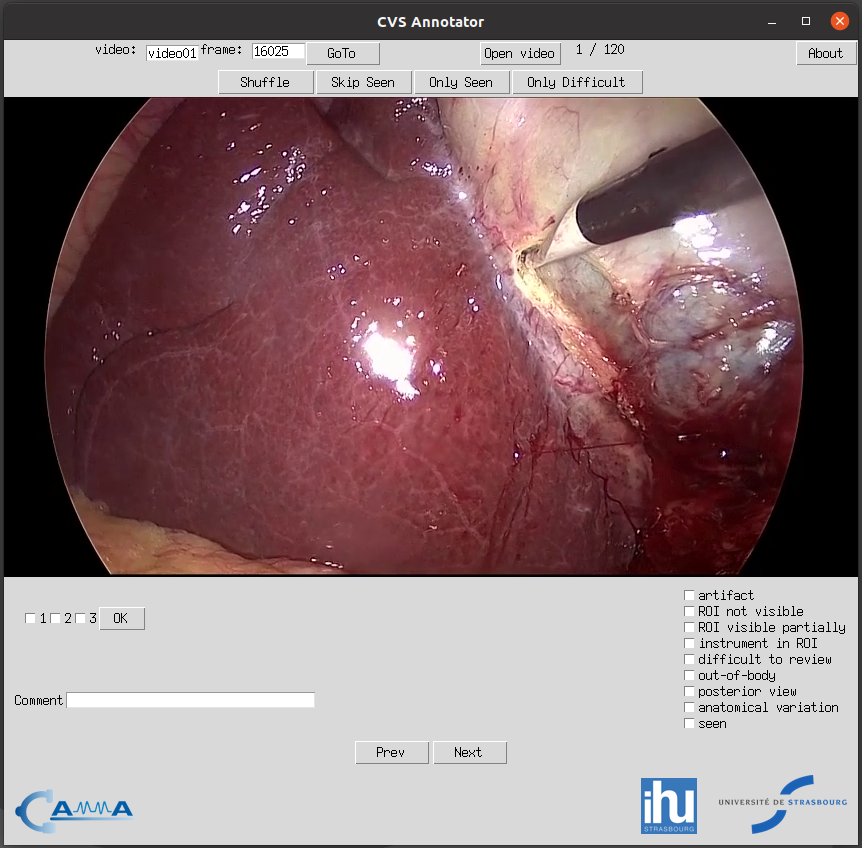

# CVS Annotator

***Research Group CAMMA / University of Strasbourg / IHU Strasbourg***

http://camma.u-strasbg.fr/

This is an application for annotating frames with an assessment of the critical view of safety (CVS) criteria and other relevant information. It allows to navigate the dataset, assess CVS achievement, presence of tools, out-of-body frames, etc. You can choose to view the frames in sequential order or shuffled to help mitigate bias during annotation. If you have the [VLC video player](https://www.videolan.org/) installed you can launch and play the video of the current frame from the moment corresponding to the frame.

## How to use

If you have Python3 and all the relevant libraries installed (_see below_) you can start the application with the `python app.py` terminal command.

When you launch the application for the first time, it will request that you select the folder containing the data (frames) that you want to annotate. After you select the directory, the application will start and you will see the first frame. You can annotate the 3 CVS criteria for that frame using the checkboxes tagged as ***1***, ***2***, ***3*** and mark frames as out-of-body, difficult to review, etc. using the checkboxes on the right. You can use the ***next*** and ***previous*** buttons to navigate the dataset. You will see the video and frame ID on the top-left of the application while the index of the current frame appears in the top-center.

You can use the ***open video*** button at the top to launch the corresponding video file; the video will open at the particular moment of the current frame. This can be helpful if the identification of anatomical structures is particularly difficult to determine and more context is necessary. 

You can learn about our annotation protocol [here](https://arxiv.org/abs/2106.10916).

The annotations are saved each time a change is made, such as when a checkbox is checked or a comment is added. The CVS criteria annotation, however, is only saved when the ***OK*** button or enter is pressed (the ***seen*** checkbox will be automatically marked).

## Dependencies
Requires VLC installed if you want to be able to play videos directly from the application. You can download it from https://www.videolan.org

If you choose to run this application with Python3, you will need to install the following libraries:

* Tkinter 
* pandas
* Pillow
* opencv-python
* pickle
* glob
* json
* numpy
* os
* subprocess
* shutil 
* pathlib

## Shortcuts
    <Left>        : Go to previous frame
    <Right>       : Go to next frame
    <Up>          : Mark frame as seen
    <F1>          : Check criteria 1
    <F2>          : Check criteria 2
    <F3>          : Check criteria 3
    <Enter>       : Validate criteria for current frame
    <Control+a>   : Toggle artifact
    <Control+n>   : Toggle ROI not visible
    <Control+r>   : Toggle ROI visible partially 
    <Control+i>   : Toggle instrument in roi
    <Control+d>   : Toggle difficult to review
    <Control+o>   : Toggle out-of-body
    <Control+p>   : Toggle posterior view
    <Control+v>   : Toggle anatomical variation

## Configuration and Data
The first time the application is opened, the user is asked to select the path to the frames. 
This is saved in a `config.json` file, the content of which is as follows:

`datapath`:   Path to the folder containing the frames organized in folders per video
`videos_dir`: Directory containing the video files 
`vlc_path`:   If VLC is not in the system PATH, the path of the VLC executable

The data (frames) to be annotated should be organized like this:
    
>    datapath
>    >    video_name_1 
>    >    >    00001.png \
>    >    >    00002.png \
>    >    >    .... 

>    >    video_name_2 
>    >    >    89540.png \
>    >    >    89565.png \
>    >    >    .... 

Video name can be anything but image name should be <frame_id>.<png/jpg> where <frame_id> has to be an integer and the extension can be either jpg or png.

Frames belonging to the same video have to be in a folder with the name of the video.

To reset the paths to the data, you can delete the `config.json` file (in the same directory as the application) or modify it directly.

To download sample data with correct data structure click [here](https://s3.unistra.fr/camma_public/github/cvs_annotator/sample_data.zip).

## Annotations 
You can annotate each frame with the following binary information:
- CVS criteria 1,2,3 (see [our annotation protocol](https://arxiv.org/abs/2106.10916))
- Presence of artifact
- ROI not visible
- ROI visible partially
- Instrument in ROI
- Difficult to review
- Out-of-body
- Posterior view
- Anatomical variation
- Frame seen

Additionally, you can also enter some free-text comment.

The annotations are saved as `annotations.pickle` and `annotations.csv` located in the same folder as the application. The application uses only `annotations.pickle` file to load and display the data, while the `annotations.csv` file can be used to manually review the annotations in a text editor.

## Credits
When using or referring to this software, please cite the following publication:

*Mascagni P, Vardazaryan A, Alapatt D, Urade T, Emre T, Fiorillo C, Pessaux P, Mutter D, Marescaux J, Costamagna G, Dallemagne B, Padoy N. Artificial Intelligence for Surgical Safety, Annals of Surgery: November 16, 2020 - doi: 10.1097/SLA.0000000000004351*

## License
This code is available for non-commercial scientific research purposes as defined in the [CC BY-NC-SA 4.0](https://creativecommons.org/licenses/by-nc-sa/4.0/). By downloading and using this code you agree to the terms in the [LICENSE](LICENSE). Third-party codes are subject to their respective licenses.

This license allows reusers to distribute, remix, adapt, and build upon the material in any medium or format for noncommercial purposes only, and only so long as attribution is given to the creator. If you remix, adapt or build upon the material, you must license the modified material under identical terms.

